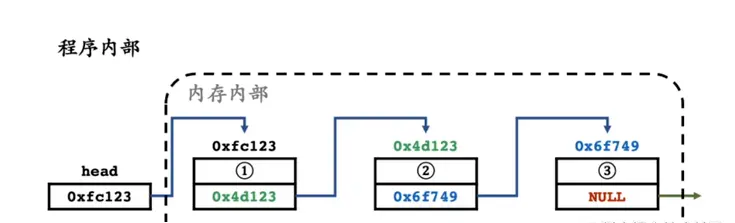
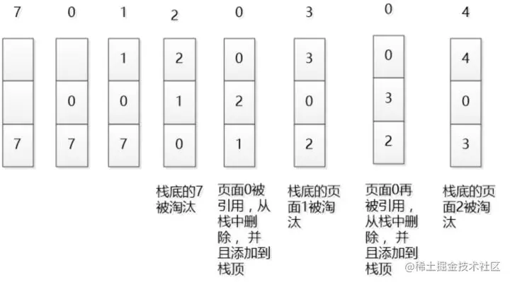

## 数据结构-链表

之前看过这样一个问题“既然已经有数组了,为什么还要链表？”

其实链表和数组各有千秋，都在不同的业务场景中发光发热，很多同学对链表可能是既熟悉又陌生。熟悉的是，我们在刷一些八股文的时候经常会看到“链表”这个字眼，陌生的是，我们在平时的开发中并不会太多的使用到链表。


### 数据结构的概念？

我们来把看起来晦涩难懂的专业术语拆分一下：

数据：对应的就是数据类型，在js中包含了基本数据类型和引用数据类型

结构：将一堆各种各样的数据按照不同的逻辑排列组合最终存储到计算机内存当中


### 算法和数据结构的关系

算法是建立在数据结构之上，对数据结构的操作需要用算法来描述；算法设计依赖数据的逻辑结构，算法的实现依赖数据的存储结构


* 常见的数据结构
数组、字典、链表、栈、队列、散列表、二叉树、堆、跳表、图等

* 常见的算法
递归、排序、二分查找、搜索、哈希算法、贪心算法、分治算法、回溯算法、动态规划、字符串匹配算法等


### 什么是链表结构

**链表的定义**

链表结构其实是内存内部的一种存储方式，链表则是把一系列节点串联起来，每个节点上至少包含两个部分： 数据域 与 指针域

数据：保存数据

指针：指向下一个节点的引用

链表中的每个节点，通过指针域的值，形成一个线性结构




**链表的优缺点**

因为链表是一种 松散 的结构体，所以当你想要找到其中的某一个节点时，只能够从 头节点 一级一级的往下找，但也因为这种松散的结构使得其进行 插入 和 删除 时只需要改变其 指针域 的指向即可
优点：适合动态插入和删除的应用场景 
缺点：不能快速的定位和随机访问数据

**链表和数组的对比**
- 数组和链表都是线性数据结构
- 数组为静态结构，静态分配内存。链表支持动态分配内存
- 数组在数据储存时是一段连续的内存空间，链表是非连续的通过指针来串联
- 数组可以根据下标定位快速查找，链表则需要遍历查找
= 数组在插入和删除时会有大量的数据移动补位，链表只需要改变指针指向

**链表应用**
- 1.浏览器历史记录、双向遍历 使用双向链表实现，支持向前/向后浏览
- 2.任务调度队列 / 进程调度表：通常使用链表组织任务，支持插入/删除任务节点
- 3.实现 LRU 缓存淘汰机制。(Redis,Memcached) LRU 是默认的缓存淘汰策略之一(实际比这个还复杂，哈希表+双向链表等实现)
- 4.CDN缓存热点内容，淘汰冷门资源。




## 封装一个链表

用js实现一个链表，链表主要有以下方法


### append方法
 添加数据
  - 1.如果链表中没有任何数据，将头部指向新数据即可
  - 2.创建一个指针，指针指向头部
  - 3.通过遍历current.next,直到current.next位空
  - 4.将新元素追加到为空的位置


### insert(position,data)方法
注意这个是向前插入如：loe在e前面插入o  lo(v)e 将v插入到e的前面

  - 1.判断边界，超出边界直接返回
  - 2.判断插入的位置
       - 在头部
          - 新元素的next指向this.head,this.head重新指向新元素
       - 不在头部
          - 1.创建一个current指针指向头部，创建一个prev指针，指向null
          - 2.通过索引遍历
          - 3.将prev指向current,current下移
          - 4.遍历结束，prev的next指向新元素，新元素的next指向current


### get(position)方法

根据索引获取数据
  - 1.判断边界，超出边界的索引直接返回false
  - 2.创建指针指向头部
  - 3.通过索引遍历链表
  - 4.返回index=position位置的data

### indexOf(data)方法返回当前data的索引

查找元素所在位置没找到返回-1
- 1.创建指针，指向头部
- 2.通过while循环，判断data是否和当前元素相等
- 3.循环结束，返回-1


### toString

打印数据
- 1.创建指针，指向头部，定义连接字符串str
- 2.while循环，拼接data
- 3.返回str


### update(position,data) 修改
更新数据-> 更新指定索引位置的数据

- 1.边界判断，超出边界直接返回
- 2.创建指针，指向头部
- 3.遍历索引，只要没到position一直遍历
- 4.找到位置，替换数据


### removeAt(position) 删除

根据位置删除,返回被删除的数据
- 1.判断边界，查出边界的直接返回null
- 2.如果移除的是头部，直接将head指向head的next即可
- 3.创建prev指向null,next指针head
- 4.通过index遍历，将prev指向current,current指向current的next
- 5.找到index后，将prev.next指向current.next

### remove(data) 删除

根据数据data删除

- 1.通过indexOf找到索引
- 2.通过removeAt删除元素


### 完整的方法

```js
class Node {
  constructor(data) {
    this.data = data;
    this.next = null;
  }
}
class LinkList {
  constructor() {
    this.head = null;
    this.length = 0;
  }
  //添加数据
  // 1.如果链表中没有任何数据，将头部指向新数据即可
  // 2.创建一个指针，指针指向头部
  // 3.通过遍历current.next,直到current.next位空
  // 4.将新元素追加到为空的位置
  append(data) {
    const newEl = new Node(data);
    if (this.length === 0) {
      this.head = newEl;
    } else {
      // 指针指向头部
      let current = this.head;
      while (current.next) {
        // 指针向下移动
        current = current.next;
      }
      current.next = newEl;
    }
    this.length += 1;
  }
  //根据索引获取数据
  // 1.判断边界，超出边界的索引直接返回false
  // 2.创建指针指向头部
  // 3.通过索引遍历链表
  // 4.返回index=position位置的data
  get(position) {
    if (position < 0 || position > this.length - 1) {
      return false;
    }
    let current = this.head; 
    let index = 0; 
    while (index < position) {
     
      current = current.next;
      index++;
    }

    return current.data;
  }
  //查找元素所在位置没找到返回-1
  // 1.创建指针，指向头部
  // 2.通过while循环，判断data是否和当前元素相等
  // 3.循环结束，返回-1
  indexOf(data) {
    let current = this.head;
    let index = 0;
    while (current) {
      if (current.data == data) {
        return index;
      } else {
        current = current.next;
        index++;
      }
    }
    return -1;
  }
  //打印数据
  // 1.创建指针，指向头部，定义连接字符串str
  // 2.while循环，拼接data
  // 3.返回str

  toString() {
    let current = this.head;
    let str = "";
    while (current) {
      str += current.data + " ";
      current = current.next;
    }
    return str;
  }
  //更新数据-> 更新指定索引位置的数据

  // 1.边界判断，超出边界直接返回

  // 2.创建指针，指向头部
  // 3.遍历索引，只要没到position一直遍历
  // 4.找到位置，替换数据
  update(position, data) {
    if (position < 0 || position > this.length - 1) {
      return false;
    }
    let current = this.head;
    let index = 0;

    while (index < position) {
      current = current.next;
      index++;
    }

    current.data = data;
    return true;
  }
  //注意这个是向前插入
  // loe在e前面插入o  lo(v)e 将v插入到e的前面

  // 1.判断边界，超出边界直接返回
  // 2.判断插入的位置
       // 在头部
          // 新元素的next指向this.head,this.head重新指向新元素
       // 不在头部
          // 1.创建一个current指针指向头部，创建一个prev指针，指向null
          // 2.通过索引遍历
          // 3.将prev指向current,current下移
          // 4.遍历结束，prev的next指向新元素，新元素的next指向current

  insert(position, data) {
    if (position < 0 || position > this.length) return false;
    const newNode = new Node(data);
    if (position == 0) {
      newNode.next = this.head;
      this.head = newNode;
    } else {
      let current = this.head;
      //指针的前一个指针
      let prev = null;
      let index = 0;

      while (index < position) {
        prev = current;
        //移动指针
        current = current.next;
        index++;
      }
      //index=position跳出指针
      prev.next = newNode;
      newNode.next = current;
    }
    //整体长度+1
    this.length += 1;
    return true;
  }

  //根据位置删除,返回被删除的数据
  // 1.判断边界，查出边界的直接返回null
  // 2.如果移除的是头部，直接将head指向head的next即可
  // 3.创建prev指向null,next指针head
  // 4.通过index遍历，将prev指向current,current指向current的next
  // 5.找到index后，将prev.next指向current.next
  removeAt(position) {
    if (position < 0 || position > this.length - 1) {
      return null;
    }

    let current = this.head;
    // 这里返回被移除的元素保存在current
    //如果是第一个，如果移除的是头部，直接将head指向head的next即可
    if (position == 0) {
      this.head = this.head.next;
    } else {
      let prev = null;
      // let current = this.head  //提到上面
      let index = 0;
      while (index < position) {
        prev = current;
        current = current.next;
        index++;
      }
      //2.找到后直接将prev指向curent的下一个元素
      prev.next = current.next;
    }
    this.length -= 1;

    return current.data;
  }
  //根据数据删除

  // 1.通过indexOf找到索引
  // 2.通过removeAt删除元素
  remove(data) {
    const position = this.indexOf(data);
    return this.removeAt(position);
  }
  //判断是否为空
  isEmpty() {
    return this.length === 0;
  }
  //获取长度
  size() {
    return this.length;
  }
}
const link = new LinkList();
export default link;

```