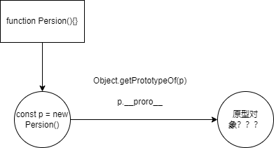
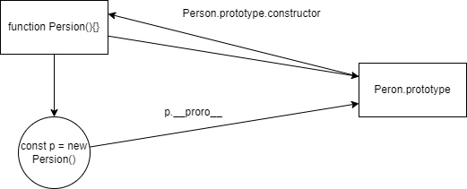

## 原型和原型链

### 什么是原型
```js
const obj = {name: "jack"}
obj.toString() // [object Object]
```
这个例子可以看到，obj对象上并没有注册toString方法，但能打印toString因为这个方法在obj对象的原型上。那么原型上有什么东西呢？

#### 在js中的引用类型
如：Array,Date,Object,Function等，都是对象，是一种属性的合集。`var a = [];var b = function(){};var c= {}`

#### js中的原型
js中创建的对象从创建开始时就和另一个对象关联，从另一个对象上获取属性，另一个对象就叫“原型”。
#### js中的原型链
对象自身上不存某个属性时，会向上从原型中查找，如果还没找到继续向原型的原型上查找，直到顶层结束。这条查找链路就叫原型链。

- 原型存在的意义： 组成原型链。
- 原型链存在的意义：继承。一个对象上找不到某个属性时，会向原型链查找。 
- 继承存在的意义： 1.属性共享。2.可扩展。

## 对象和创建对象

对象创建主要有两种，一种是通过New操作，另一种是字面量。但字面量也是New只是更简洁。
Number、String、Boolean、Array、Object、Function、Date、RegExp、Error这些都是函数，而且是原生构造函数，在运行时会自动出现在执行环境中。

```js
//自定义对象p
function Person() {}
const p = new Person();

//系统对象d
const d = new Date();
```

## 对象属性__proto__和prototype
每一个对象都有原型，那么怎么查看原型呢，通过__proto__属性。只要是引用类型都有__proto__属性


```js
function Person() {}
const p = new Person();
// p.__proto__ or Object.getPrototypeOf(p) 获取原型

```

### 实例对象如何共享属性和方法


```js
//
function Person() {}
const p1 = new Person();
//假设通实例__proto__添加属性
p1.__proto__.eat = function() { return 'eat'}

function Person() {}
const p2 = new Person();

p2.eat() // eat
```
上面的例子能达到共享属性的能力，但是试想一下，要添加的属性很多呢，每次需要先建p1操作p1.__proto__非常不合理。这个时候就要用到刚刚的原型对象了，
p1.__proto__ === Person.prototype,每一个构造函数有一个prototype属性.

这样通过操作Person.prototype属性就能达到共享的母的。

```js
function Person() {}
Person.prototype.eat=function() { return "eat"}
const p1 = new Person()
p1.eat() // eat
const p2 = new Person()
p2.eat() // eat
```
**总结**
- 1.引用类型都有__proto__属性，指向它们的原型
- 2.只有函数有prototype属性，指向 new Fn()出来的__proto__ `const p1 = new Person();`  function  Person()的prototype 指向p1.__prototype

## 原型链顶层
原型链之所以叫原型链不叫原型环，因为它有始有终，那么链条的顶层是什么呢？
```js
//1.person的原型

p.__proto__ === Person.prototype
```
Person.prototype也是一个普通对象，可以理解为Object构造函数创建的。
```js
// 2.Person.prototype的原型
Person.prototype.__proto__ === Object.prototype
```

Object.prototype的原型

```js
//注意Object.prototype比较特殊，指向null
Object.prototype.__proto__ === null
```

整个读取的顺序我们其实可以来模拟一下

```js
function getAttr(attrName,obj){
  if(obj.hasOwnProperty(arrtName)) {
    return obj[attrName]
  }else if(obj.__proto__!==null) {
    return getAttr(attrName,obj.__proto__)
  }else {
    return undefined
  }
  
}
```

## constructor
每一个原型中有一个constructor指向构造函数如 ```Person.prototyper.construct === Person```


## 函数对象的原型链
我们知道引用类型是对象，函数也是对象， 那么函数的原型链是什么呢，对象都是被构造函数创建的，函数对象的构造函数就是Function

```js
let fn = function() {}
fn.__proto__  === Function.prototype
// const Array = new Function(); 可以这么理解
Array.__proto__ === Function.prototype
Object.__proto__ === Function.prototype
//Function.prototype是一个普通对象
Function.prototype.__proto__ === Object.prototype
```

## 原型链的三种形式

第一种，自定义对象

```js


function Person() {}
const p = new Person()

p.__proto__ === Person.prototype

Person.prototype.__proto__ = Object.prototype

Object.prototype.__proto__ === null
```

第二种函数类型

```js

var f = function() {}  

f.__proto__ = Function.prototype

Function.prototype.__proto__ === Object.prototype
// or

Array.__proto__ = Function.protype
Function.prototype.__proto__ === Object.prototype

```

第三种普通对象类型

```js
var obj = {} // obj = new Object()

obj.__proto__ ==== Object.prototype
```
## instanceof 操作符
```js
let fn = function() {}
let arr = []

fn instanceof Function  //true
fn instanceof Object //true
arr instanceof Array // true
arr instanceof Object // true
```
为什么fn instanceof Object和arr instanceof Object都返回true呢?

> instanceof运算符用于测试构造函数的prototype属性是否出现在对象的原型链中的任何位置


也就是说，instanceof 右边的对象能否在左边的原型链上找到

```js
function myInstanceof(obj,Constructor) {
 let left = obj.__ptoto__;
 let right = Constructor.prototype;

 if(left===null) {
    return false
 }
 if(left===right) {
  return true
 }else{
  return myInstanceof(obj.__pro__,Constructor)
 }
 
}
```
## Object.create()

Object.create方法创建一个对象，且将第一个参数作为该对象的原型
```js
const myCreate = function(obj) {
  function P() {};
  P.prototype = obj
  return  new P()
}

```

## new 操作符有什么作用

- 1.创建一个对象，对象的__proto__指向new后面函数的prototype.
- 2.将构造函数this指向这个新对象，执行构造函数。
- 3.如果构造函数返回对象类型Object(Array,Date,Function)等正常返回，否则返回新对象

```js
function myNew(Func,...arg) {
  if(typeof Func !=="function") {
    throw new Error("传入的参数必须是function")
  }
  let newObj = Object.create(Func.prototype)
  let res = Func.apply(newObj,arg);
  return res instanceof Object ?res:newObj
}

const Person = function(name,age) {
  this.name = name;
  this.age = age
}

const p = myNew(Person,'jack',20)


```
