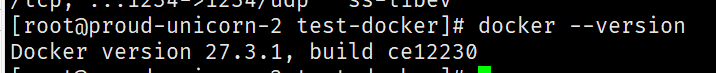
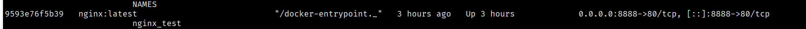
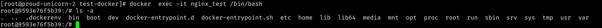
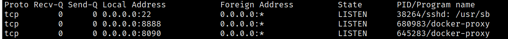

## docker入门知识

> docker是一个开源的应用容器引擎。


### 什么是容器？

容器是一种轻量级的虚拟化技术 ，它是一个由应用运行环境、容器基础镜像组成的集合。
以 Web 服务 Nginx 为例Nginx 容器是由 Nginx 主程序、Nginx 运行依赖组件（gcc、pcre、openssl）、CentOS 7 基础镜像组成。（注：CentOS 7 基础镜像并非完整的操作系统镜像，只是操作系统的基础文件和库文件）


                          
### docker和容器

容器是一种虚拟化技术，docker 是实现容器的一种工具，我们称它为容器引擎；可以驱动容器的引擎还有 podman、containerd 等，docker 是目前市面上应用范围最广的一种容器引擎。

## 安装docker

以centos7.x为例

下载相关库
```shell
sudo yum install -y yum-utils

```

设置仓库镜像地址为阿里云

```shell
sudo yum-config-manager \
    --add-repo \
    http://mirrors.aliyun.com/docker-ce/linux/centos/docker-ce.repo
```

设置最新的`docker`引擎

```shell
sudo yum install docker-ce docker-ce-cli containerd.io    
```

设置开机自启动docker
```shell
## 开机自启
systemctl enable docker

## 启动
systemctl start docker
```

测试docker

```shell
docker --version

```
出现如下 


设置开机关闭
```shell
systemctl stop docker
```

卸载docker
```shell
sudo yum remove docker-ce docker-ce-cli containerd.io

sudo rm -rf /var/lib/docker 
sudo rm -rf /var/lib/containerd
```

## docker启动容器

以nginx为例

```shell

docker run -d --name nginx_test nginx
```

这里要解释一下做了什么

```shell
-d # 后台运行
--name # 启动后的容器名称
nginx  # 启动的image

```

得到的运行效果如下：



我们可以进入容器查看服务

```shell
docker exec -it nginx_test /bin/bash

ls -a 
```




很明显我们进入的是一台新的服务器。使用`exit`退出当前容器


### 本机如何访问容器里面的服务呢？

比如容器服务里面的nginx默认启动的是80端口，本机是怎么访问这个80呢？我们可以是用端口号映射的方式，本地做一个代理，从而达到访问的目的。

```shell 

docker run -d --name nginx_test -p 8888:80 nginx

## -p 8888:80 
## -p 代表端口映射
## 8888:80前面的端口号代表本机，后面的端口号代表容器服务
```





我们使用采用curl的方式验证本机端口是否访问的通。

```shell
curl youip:8888
```


### 如何将容器内的数据永久存储

我们先来做个测试，测试内容是修改容器内的文件，然后删除容器、重建容器，查看文件是否会保持修改后的状态。
第一步、修改 Nginx 容器的 index.html 查看是否生效
我们尝试通过修改 Nginx 的 index.html 文件来更换页面信息；


```shell
#先进入 nginx_test 容器中；
docker exec -it nginx_test /bin/bash
 
#然后切换到 Nginx 的 html 目录
cd /usr/share/nginx/html
 
#vi 打开 index.html
vi index.html
 
#输入一段文本，并保持退出编辑
hello nginx
```

我们保存后退出，继续执行curl ip+8888，页面会返回 `hello nginx`而不是nginx的默认页面。

第二步、删除 Nginx 容器，然后重新创建 Nginx， 观察 index.html 内容是否保持修改后状态

```shell
#删除 nginx_test 容器
docker rm -f nginx_test
 
#重新创建 nginx_test
docker run -d --name nginx_test -p 8888:80 nginx
```

继续curl+ip:8888发现页面是初始化的页面而不是原来的页面。可见，curl 返回了 Nginx 默认的页面信息，并不是我们修改的内容，这是因为我们删除了容器，容器内的所有文件都一同删除了。如果想在删除容器时，保持指定文件或目录不被删除，该怎么做呢？将宿主机的目录映射到容器目录，我们称这个操作为：持久化存储在创建容器时使用 `-v` 参数将宿主机目录映射到容器目录.

```shell
docker run -d --name nginx_test -p 8888:80 -v /mnt/nginx:/usr/share/nginx/html nginx
 

##  -v /mnt/nginx:/usr/share/nginx/html 

## /mnt/nginx:/usr/share/nginx/html 前者是本机，后者是容器目录
```


## docker命令总结

### 容器命令

- docker ps -a 查看所有的容器（运行的和不运行的都会出现）
- docker start nginx_test  启动容器 nginx_test
- docker stop nginx_test 暂停容器 nginx_test
- docker restart nginx_test 重启容器nginx_test
- docker rm -f nginx_test 删除nginx_test
- docker exec -it nginx_test /bin/bash 进入到正在运行的容器内部
- docker logs nginx_test 查看容器日志
- docker cp nginx_test/home/test.js /home 从容器拷贝文件到本机
- docker cp /mnt/test.js  nginx_test/home 从本机拷贝文件到容器 
### 容器镜像命令

- docker images 展示所有的镜像
- docker rmi nginx:latest 根据名字删除镜像
- docker rmi 12333 根据镜像的id删除镜像
- docker pull nginx 下载远程的镜像到本机
- docker build -t nginx:xiuxiumomo . 根据文件打包自己的镜像


## Dockerfile的使用

Dockerfile就是用来构建镜像的配置文件。（生成image）

写一个简单的dockerfile文件

```shell
## 以centos为基础image
FROM centos
## 创建的容器初始化的时候新建dir1 dir2
VOLUME ["dir1","dir2"]

## 执行脚本
CMD ["/bin/bash"]
```

构建自己的镜像,注意，要在含有`Dockerfile`的目录下执行

```shell
## -f 指定构建的配置文件
docker build -f Dockerfile1 -t momo_centos .

## 如果配置文件为Dockerfile

docker build  -t momo_centos .


## 加上版本号，如果不加就是latest

docker build  -t momo_centos:1.0 .
```

执行自己构建的镜像，创建一个容器


```shell
docker run -it momo_centos /bin/bash

ls -a ## 可以看到dir1 dir2
```


### DockerFile的相关指令

- FROM	# 基础镜镜像,一切从这里开始构建
- MAINTAINER	# 镜像是谁写的,姓名+邮箱
- RUN	#镜像构建的时候需要运行的命令
- ADD	# 例如：步骤: tomcat镜像,这个tomcat压缩包!添加内容
- WORKDIR	# 镜像的工作目录
- VOLUME	# 挂载的目录
- EXPOSE	# 保留端口配置
- CMD	# 指定这个容器启动的时候要运行的命令,只有最后一个会生效,可被替代
- ENTRYPOINT	# 指定这个容器启动的时候要运行的命令,可以追加命令
- ONBUILD	# 当构建一个被继承DockerFile这个时候就会运行ONBUTLD 的指令,触发指令.
- COPY	# 类似ADD ,将我们文件持贝到镜像中
- ENV	# 构建的时候设置环境变量!

写一个完整的centos

```shell
## Dockerfile

FROM centos
MAINTAINER xiuxiumomo<lsqxxmm@gmail.com>

WORKDIR /home

RUN yum -y install vim

RUN yum -y install net-tools

EXPOSE 80

CMD ['/bin/bash']


```


## docker-compose介绍

- docker-compose 是一个容器编排工具（自动化部署、管理）;
- 它用来在单台 Linux 服务器上运行多个 Docker 容器;
- docker-compose 使用YAML文件来配置所有需要运行的 Docker 容器，该 YAML 文件的默认名称为docker-compose.yaml


### 安装docker-compose

```shell
curl -L https://github.com/docker/compose/releases/download/v2.14.1/docker-compose-$(uname -s)-$(uname -m) -o /usr/local/bin/docker-compose

chmod +x /usr/local/bin/docker-compose
```

检查是否安装完成

```shell
docker-compose --version
```


### 写一个简单docker-compose

以nginx为例，写一个简单的docker-compose

```shell
## docker-compose.yaml

version: '2.1'
services:
  nginx:
    image: nginx:latest
    container_name: nginx_test
    ports:
      - 8888:80
    volumes:
      - /mnt/nginx:/usr/share/nginx/html

```

参数解读

```shell
## version 版本
## service container服务
## nginx nginx服务

## image nginx:latest nginx的最新版

## container_name 容器名称

## ports 端口号映射

## volumes 文件夹映射
```

启动容器

```shell
docker-compose up -d
```


### docker-compose创建多个容器

以同时创建nginx和redis为例

```shell
version: '2.1'

services:
  nginx:
    image: nginx:latest
    container_name: nginx_test
    ports:
      - 8888:80
    volumes:
      - /mnt/nginx:/usr/share/nginx/html
 
  redis:
    image: redis:latest
    container_name: redis_host1
    ports:
      - 63790:6379
    networks:
      - host1-network
 
networks:
  host1-network:
    driver: bridge
    ipam:
      driver: default
      config:
        - subnet: 192.168.11.0/24
          gateway: 192.168.11.254
```


### docker-compose命令总结

**注意** 执行命令的时候目录必须在含有docker-compose.yaml的文件下

- docker-compose up -d 启动容器
- docker-compose down 停止容器
- docker-compose restart 重启容器
- docker-compose up --force-recreate -d  重载 
