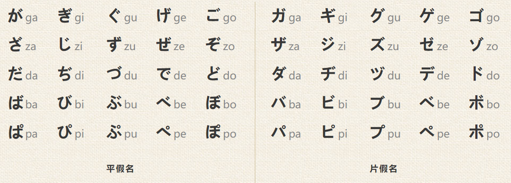
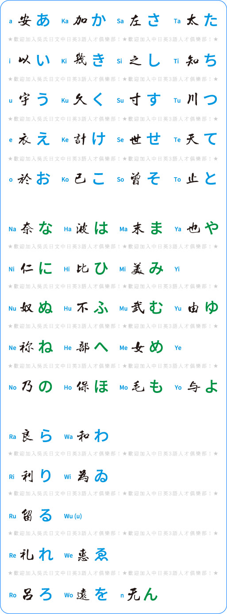
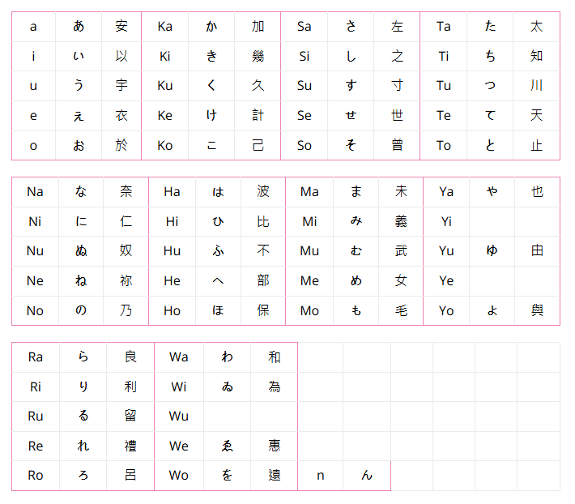
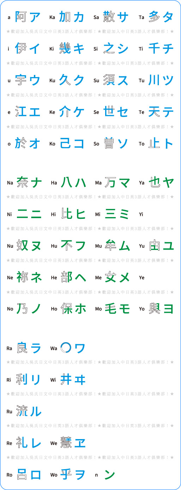
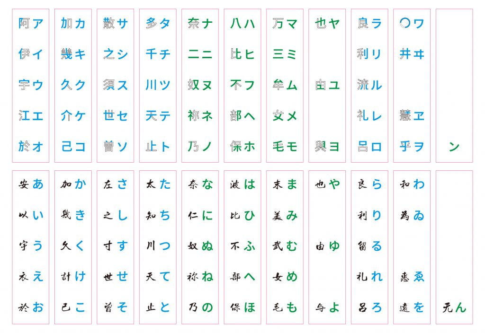

## 五十音对照表

| 罗马音 | 日语假名 | 汉字 | 罗马音 | 日语假名 | 汉字 | 罗马音 | 日语假名 | 汉字 | 罗马音 | 日语假名 | 汉字 |
| ------ | -------- | ---- | ------ | -------- | ---- | ------ | -------- | ---- | ------ | -------- | ---- |
| a      | あ       | 安   | Ka     | か       | 加   | Sa     | さ       | 左   | Ta     | た       | 太   |
| i      | い       | 以   | Ki     | き       | 幾   | Si     | し       | 之   | Ti     | ち       | 知   |
| u      | う       | 宇   | Ku     | く       | 久   | Su     | す       | 寸   | Tu     | つ       | 川   |
| e      | え       | 衣   | Ke     | け       | 計   | Se     | せ       | 世   | Te     | て       | 天   |
| o      | お       | 於   | Ko     | こ       | 己   | So     | そ       | 曾   | To     | と       | 止   |
| Na     | な       | 奈   | Ha     | は       | 波   | Ma     | ま       | 未   | Ya     | や       | 也   |
| Ni     | に       | 仁   | Hi     | ひ       | 比   | Mi     | み       | 義   | Yi     |          |      |
| Nu     | ぬ       | 奴   | Hu     | ふ       | 不   | Mu     | む       | 武   | Yu     | ゆ       | 由   |
| Ne     | ね       | 祢   | He     | へ       | 部   | Me     | め       | 女   | Ye     |          |      |
| No     | の       | 乃   | Ho     | ほ       | 保   | Mo     | も       | 毛   | Yo     | よ       | 與   |
| Ra     | ら       | 良   | Wa     | わ       | 和   |        |          |      |        |          |      |
| Ri     | り       | 利   | Wi     | ゐ       | 為   |        |          |      |        |          |      |
| Ru     | る       | 留   | Wu     |          |      |        |          |      |        |          |      |
| Re     | れ       | 禮   | We     | ゑ       | 惠   |        |          |      |        |          |      |
| Ro     | ろ       | 呂   | Wo     | を       | 遠   | n      | ん       |      |        |          |      |

记忆方法：

### a

安以轩二件衣服掉到藕淤泥

安  以  宇轩   二衣  藕淤泥

あ  い  う   え   お 

### ka

卡德加开动机器久苦百姓按克计算扣给自己

卡得加  机器  苦久  克计算  扣己

か     き    く    け    こ

### sa

傻向左和王羲之去苏村谈私事，竟然说成了。

傻左 羲之  苏村  私事 说成（曾）

さ   し    す   せ  そ

### ta
 
塔台上放下梯子跳到土川上偷红薯特甜吃到透支了。

塔台（太）  梯子（知）  土川   特甜（天）  透支（止）

た         ち         つ    て         と

### na

娜娜拟任努努，拿权力去弄牛奶

娜娜（奈）   拟任    努努（奴）  拿权  弄奶（乃）

な           に    ぬ        ね    の

### ha

哈利波特把hebe压倒地上她呼吸不过来，黑人部队过来了只是给她的荷包上个保险

哈里（波）特   hebe（比）    呼吸（不）过来  黑人（部）队  荷包（保）险

は             ひ         ふ               へ        ほ

### ma

马尾变成迷妹走进木屋坐了一个美女在摸自己的毛发

马尾（未）  迷妹（美）  木屋（物）  美（女）  摸（毛）

ま         み        む         め      も

### ya

芽叶（也） 鱼油（由） 哟西（与）

や       ゆ        よ

### ra

拉梁到风和日丽的下午万只鹿在看还带来礼物礼物是一个萝莉

拉梁（良）   日丽（利）   鹿（万）   （礼）  萝莉（吕）

ら          り         る         れ        ろ

### wa

和       为          惠          遠

わ       ゐ          ゑ          を

十口     为          る+心        大+么

## 片假名

### a行

知了通过大力水手跳到草里面，草追着夕阳到十足里面了，十足里面老八拿出令牌说你必须到池塘里，变成礼物，礼物打开是治疗口吃的药。

ア  カ   サ  タ ナ ハ マ  ヤ ラ ワ
 
### i行

仙人来到了庆丰包子铺里面有个铁三角，三角供奉的是九千岁，店小二在九千岁面前比心然后跑到了三小，三小里面有个仙人和小李飞刀打架，后面又来了一个仙人
イ   キ   シ   チ  ニ   ヒ   ミ   イ  リ ィ

### u行
守门员在拼多多买了苏州人，苏州人跑到四川变成了难民拿着粪叉去收复台湾派侯爷的小儿子攻打守门员

ウ ク  ス   ツ  ヌ   フ  ム   ユ   ル   ウ

## 所有

