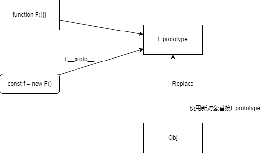

## 归集常见的手写题目以及原理

## 手写Object.create()

> Object.create(proto,propertiesObject) 静态方法以一个现有对象作为原型，创建一个新对象。proto 新创建对象的原型对象。
> 如如果该参数被指定且不为 undefined，则该传入对象可枚举的自有属性将为新创建的对象添加具有对应属性名称的属性描述符。这些属性对应于 Object.defineProperties() 的第二个参数。


```js

Object.create(proto)
Object.create(proto, propertiesObject)

```

简单的说，就是以传入的对象作为原型，新创建一个对象，如果希望没有原型，直接传入null,这个时候创建的对象往往性能更高 `obj.__prot__=null`

例子：
```js
const a = {
  name: 'jack',
  age: 20
}
const obja = Object.create(a);
obja.age // 20
```

实现过程：✍️
```js
function _create(obj) {
  //创建一个构造函数
  function F() {}
  //构造函数的原型替换成新加入的obj
  F.prototype = obj;
  //返回对象
  return new F();
}


const obja2 = _create(a);
```

实现思路：🤔

- 创建构造函数
- 将构造函数的prototype指向传入的对象
- 通过new新建对象且返回





## 手写instanceof

instanceof具体介绍在[原型](/src/javascript/prototype/prototype.html)里面已经有具体的介绍了.

手写：
```js
function myInstanceof(obj,Constructor) {
 let left = obj.__ptoto__;
 let right = Constructor.prototype;

 if(left===null) {
    return false
 }
 if(left===right) {
  return true
 }else{
  return myInstanceof(obj.__proto__,Constructor)
 }
 
}
```


## 手写new

new操作符通常用来创建对象，常用类的对象实例化，如：`new Person() new Date()`等等。那么new这个过程发生了什么。

例子
```js
function Person(name,age) {
  this.name = name;
  this.age = age
}
//new实现p对象
const p = new Person();

//new实现d对象
const d = new Date();
```

实现思路：🤔

- 创建一个对象
- 对象的__proto__ 指向构造函数的prototype
- 执行对象函数的方法，且该方法的`this`绑定到新创建的对象上。


实现过程：✍️
```js

function _new(func,...arg) {
  //1.创建一个对象
  const obj = {};
  //2.对象的__proto__ 绑定到构造函数的prototype
  obj.__proto__ = func.prototype;
  //3.执行对象函数的方法，且该方法的`this`绑定到新创建的对象上。
  const res = func.apply(obj,arg);
  //4.注意这里如果有值返回，直接返回对象如下面：

  // function Person(name,age) {
  //   this.name = name;
  //   this.age = age;
  //   return this;
  // }
  //这个时候直接返回对象而不是新创建的对象
  if(typeof res === 'object') {
    return res
  }
  return obj
}


```

使用方法：🦖
```js

function Person(name,age) {
  this.name = name;
  this.age = age;
}


const p = _new(Person,'jack',20)
console.log(p.name) // jack
```

## 手写Promise.all方法

介绍

Promise.all方法用于执行Promise.all队列，如果全部正确那么结果将按照队列顺序返回，如果有一个出错，直接返回出错任务。

列子:🫡
```js

// 定义一些返回 Promise 的函数
function asyncTask(name, delay) {
  return new Promise((resolve, reject) => {
      setTimeout(() => {
          // 随机失败的情况
          if (Math.random() > 1) {
              resolve(`${name} 完成`);
          } else {
              reject(`${name} 失败`);
          }
      }, delay);
  });
}

// 创建一个 Promise 数组
const promises = [
  asyncTask("任务1", 1000),
  asyncTask("任务2", 2000),
  asyncTask("任务3", 1500),
];

// 使用自定义的 myPromiseAll 函数
Promise.all(promises)
  .then(results => {
      console.log("所有任务完成:", results);
  })
  .catch(error => {
      console.error("有任务失败:", error);
  });

  // 有任务失败: 任务1 失败


  // 修改一下方法
function asyncTask(name, delay) {
  return new Promise((resolve, reject) => {
      setTimeout(() => {
          // 随机失败的情况
          if (Math.random() > 0) {
              resolve(`${name} 完成`);
          } else {
              reject(`${name} 失败`);
          }
      }, delay);
  });
}

// [ '任务1 完成', '任务2 完成', '任务3 完成' ]

```

实现思路：🤔

- 定义参数类型为promise数组
- 定义计数器和返回值数组
- 循环参数，每一次在成功的时候累加定时器，当总数=参数长度的时候，将结果resove返回
- 循环的过程中只要有报错，直接返回报错。否则返回成功


实现过程：✍️
```js
function myPromiseAll (promises) {
  //1.判断参数
  if(!Array.isArray(promises)) {
    throw new Error(`params must be arrays`)
  }
  //2.返回promise
  return new Promise((resolve,reject)=> {
    //定义计数器
    let count = 0;
    //定义结果
    let res = [];
    const len = promises.length;
    promises.forEach((promise,i)=>{
      //遍历执行
      Promise.resolve(promise).then((value)=>{
        count+=1;
        res[i] = value;
        //全部成功
        if(count===len) {
          resolve(res)
        }
        //只要有一个错误，直接reject
      }).catch(reject)
    })
  })
}

```

使用方法：🦖

```js

// 定义一些返回 Promise 的函数
function asyncTask(name, delay=1000) {
    return new Promise((resolve, reject) => {
        setTimeout(() => {
            // 随机失败的情况
            if (Math.random() > 0.5) {
                resolve(`${name} 完成`);
            } else {
                reject(`${name} 失败`);
            }
        }, delay);
    });
}

// 创建一个 Promise 数组
const promises = [
    asyncTask("任务1", 1000),
    asyncTask("任务2", 2000),
    asyncTask("任务3", 1500),
];

// 使用自定义的 myPromiseAll 函数
myPromiseAll(promises)
    .then(results => {
      //如果成功返回数组
        console.log("所有任务完成:", results);
    })
    .catch(error => {
      //如果失败，返回失败内容如： `${name} 失败`
        console.error("有任务失败:", error);
    });

```


## debounce方法

> debounce是项目中常见的方法，该方法的作用是减少事件发生的频率，如：输入框查询时候，当检测到输入框在输入的时候不触发，合并到最后一次
> 再去触发

列子:🫡

```js
window.addEventListener('resize',debounce(()=> {
  console.log('正在change')
}))
```

实现思路：🤔
- 参数定义1.要执行的函数 2.延迟时间 (在某个时间范围内，开关是存在的，只有在这个时间外，才去执行)
- 使用闭包的概念设置开关
- 清除前面每一次设置的定时器，只执行最后一次的定时器。

实现过程：✍️
```js
function debounce(fn,delay=500) {
  //1.定义开关
  let timer = null;
  return function(...arg) {
    const that = this;
    //只要触发直接清除
    clearTimeout(timer);
    //创建定时器，定时器将在delayms后触发
    timer = setTimeout(()=>{
      fn.applay(that,arg)
    },delay)
  }
}


```


使用方法：🦖

```js
window.addEventListener('resize',debounce((e)=> console.log('变化了'))

```

```vue
<template>
  <el-input @input="debounce(handlerInput)" v-model="val"></el-input>
</template>
<script>
export default {
  data() {
    return {
      val: ''
    }
  },
  methods: {
    handerInput(val) {
      
    }
  }
}
</script>
```

## throttle  

> throttle  是一种控制函数执行频率的技术，主要用于限制某个函数在一定时间内的调用次数。与debounce不同， throttle在指定的时间间隔内会确保函数至少被调用一次。它通常用于处理高频率的事件，比如滚动、窗口调整大小、鼠标移动等。


注意
`throttle`在指定的时间节点内，能够至少保证执行一次。如： 平均2s内能够执行一次


列子:🫡

```js
window.addEventListener('resize',throttle((e)=> console.log('执行了'))

```

实现思路：🤔
- 定义参数： 1.回调函数 2.时间段内如2000ms
- 设计一个时间戳记录执行时间
- 执行回调方法，更新记录时间


实现过程：✍️
```js
//该方法只要注册上，第一次会立即执行
function throttle(fn, limit = 1000) {
  let time = Date.now();
  return function (...arg) {
    const nows = Date.now();
    const that = this;
    if (nows - time >= limit) {
      fn.apply(that, arg);
      time = nows;
    }
  };
}

//该方法初始化不执行，只有最后一次停下来的时候会执行一次
function throttle(fn,limit=1000) {
  let timer = null;
  return function(...arg) {
    const that = this;
    //只有在没有定时器的情况下生成一个定时器
    if(!timer) {
      timer = setTimeout(()=>{
        //在limt时间内执行一次，然后销毁
        fn.apply(that,arg)
        timer = null;
      },limit)
    }
    //有定时器不做任何事情
  }
}
```


使用方法：🦖


```js
window.addEventListener('resize',throttle((e)=> console.log('变化了'))

```